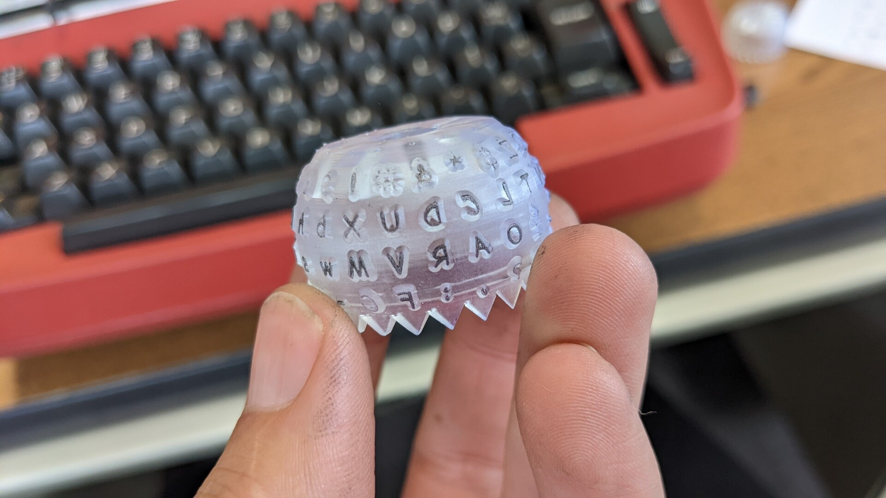
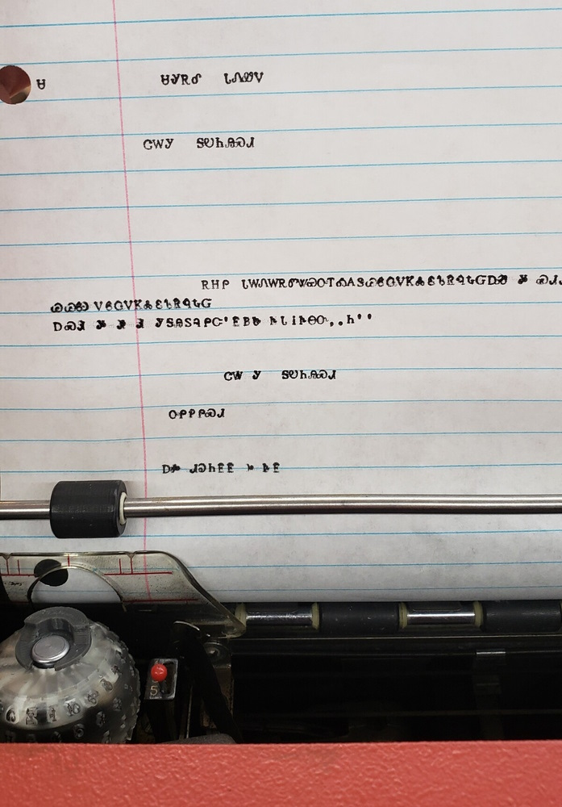
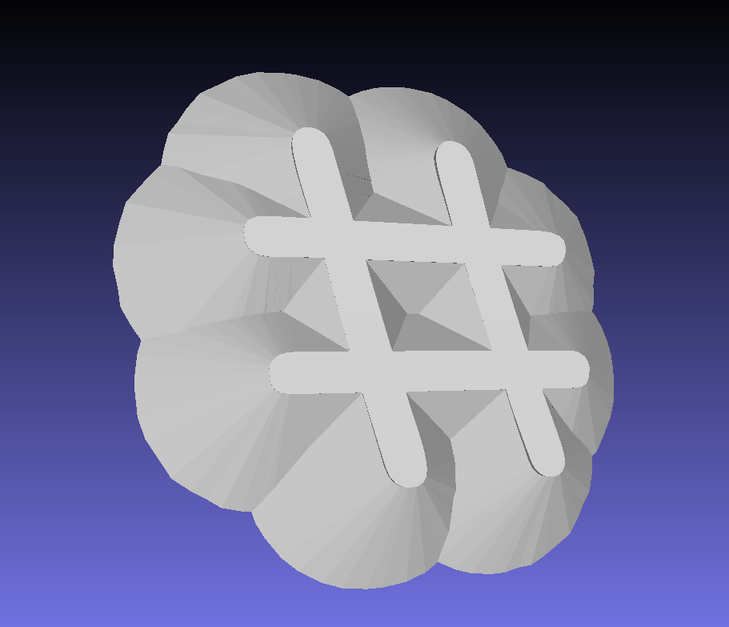
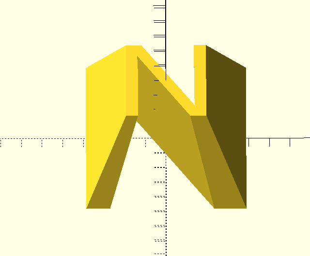
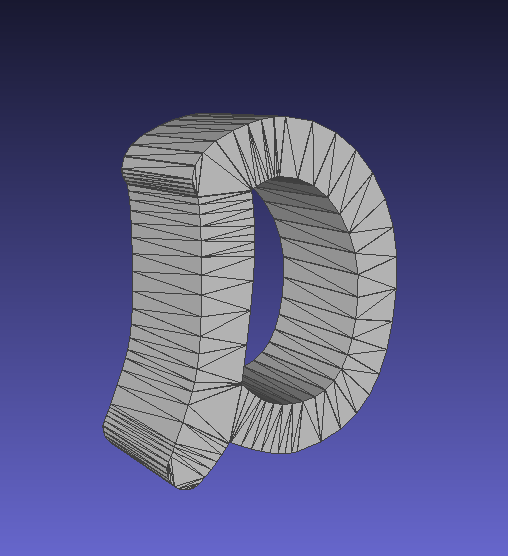
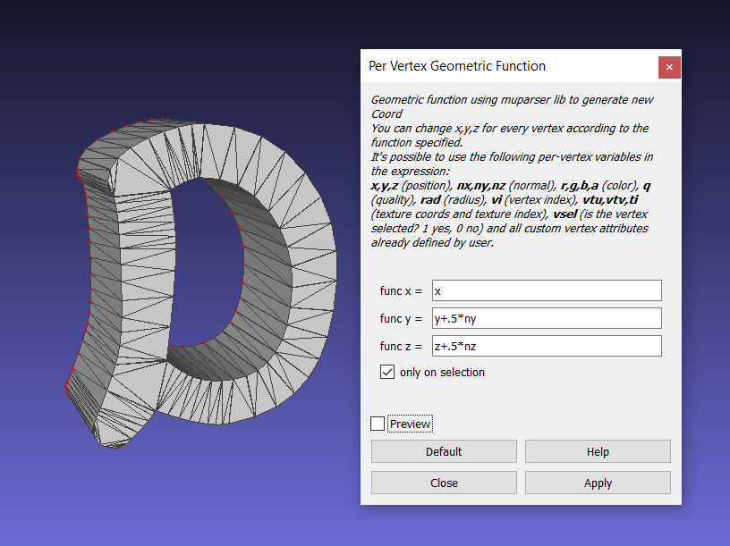
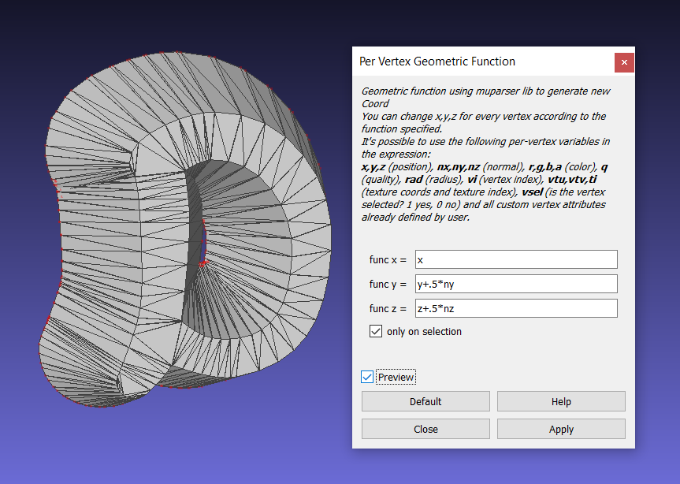
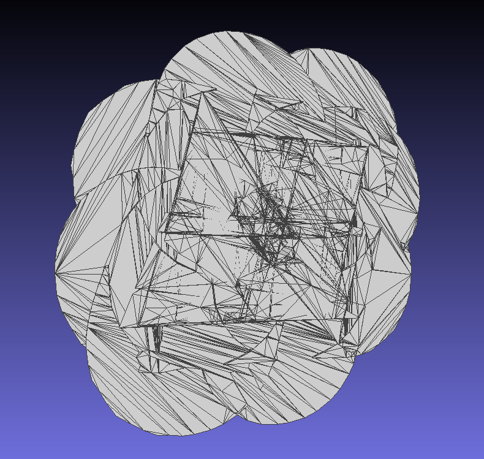
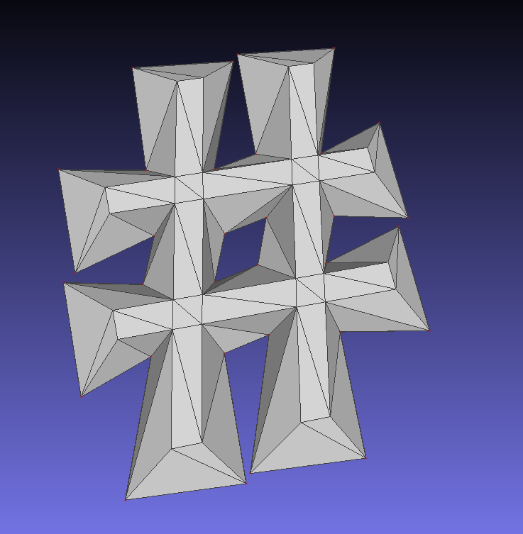
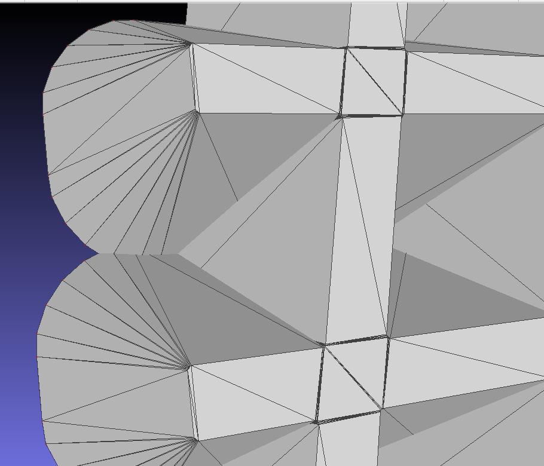

# How to make your own Selectric Typeballs

## March 31, 2023

# Remind me to put some of these up for sale through Shapeways, for folks who don't want to print them themeslves!




The [IBM Selectric typewriter](https://www.ibm.com/ibm/history/ibm100/us/en/icons/selectric/) uses an instantly-recognizable "ball" of type instead of a fanned-out array of arms like a conventional typewriter. These typeballs could be swapped out, meaning you could easily write documents with different fonts, font sizes, special characters, or different writing systems altogether.

IBM and some other vendors made lots of different typeballs, but most of them are 40-50 years old and no one has been making new typeballs for a long time. 3D printing is a natural fit for making new typeballs, but most printers still don't have the ability to produce the sharp details necessary on a sufficiently-resilient material. So it's understandable that no one made a really functional 3D-printable typeball. Until now, that is!

## How to use the code
Things you need before getting started:
* OpenSCAD (This will possibly be replaced with CadQuery in a later revision, please be aware! Until then I only know how to run this program on Windows.)
* A Python installation with the [pymeshlab](https://pypi.org/project/pymeshlab/) package

1. Open `oneletter.scad` and change lines 10 and 11, the ones that specify the font height (in millimeters) and the font name/style for OpenSCAD to use.
1. Open `selectric_generator.py` and change line 5, the one that says `PATH TO OPENSCAD = r"{something}"` so that it points to your installation of `openscad.com` (not `openscad.exe`! They are in the same folder probably, but the `.com` is meant to be run from command line, which is what we'll be doing.
1. If you want to change the keyboard layout, edit `uppercase.txt` and `lowercase.txt`. Each .txt file has four rows, representing the characters in order on the Selectric keyboard. For example, for a standard QWERTY keyboard layout the files should look like:
```
uppercase.txt
!@#$%¢&*()_+
QWERTYUIOP¼
ASDFGHJKL:"
ZXCVBNM,.?
```
```
lowercase.txt
1234567890-=
qwertyuiop½
asdfghjkl;'
zxcvbnm,./
```
1. Run `selectric_generator.py`. On my machine, each character takes between 1 and 30 seconds to generate, depending on their complexity. So 88 characters will take a while, be patient!

## Acknowledgements

The blank typeball is based on [1944GPW's typeball on Thingiverse](https://www.thingiverse.com/thing:4126040), which is released under a Creative Commons-Attribution license. I suspect that my project wouldn't exist if it weren't for this one. I had to change most of their typeball dimensions, and there are major issues with the way their characters are generated, but I sure as heck would have made those same errors myself, so I'm infinitely grateful for the people before me who documented their processes!

Another project that deserves a lot of credit is [The Sincerity Machine by Jesse England](jesseengland.net/project/sincerity-machine-the-comic-sans-typewriter/). Jesse is a delight and a constant source of creative inspiration for me, and it brings me great joy to watch this project evolve with him.

## EXPLAINING HOW THE GEOMETRY WORKS, BECAUSE I'M REALLY QUITE PROUD OF IT (BUT YOU CAN SKIP THIS SECTION, IT WON'T HURT MY FEELINGS)



Getting those nice lofted edges on each glyph was not easy! It was a great mental exercise for me, and I'm sure there are lots of other ways to do it. I'd be very curious to hear how you would have approached it!!

The [OpenSCAD Typeball by 1944GPW](https://www.thingiverse.com/thing:4126040) attempts to loft the shapes by scaling the letterform. This was my first thought, as well, but since the letters scale around a specific point, it means the lofted sides won't all spread out evenly. Instead you get unhelpful overhangs:



Instead of a scaled extrusion, we need the base to be a puffed-out offset version of the original letterform. It's not easy to do that in an automated fashion, especially if there are small holes that will close up (like in the middle of the # character).

I'm quite happy with the method I came up with! First, a command-line script extrudes the letter in OpenSCAD and exports an STL (I might try to switch to Cadquery, so I can have a pure-python solution, but that's for later).



It's important that all the vertices are on either the top face of the letter or the bottom face of the letter; there aren't any vertices mid-way along the extrusion. That makes the next step possible: I grab all the vertices on the bottom face and displace them by their normal vectors. This means the vertex will always be pushed *out* away from the body of the STL.




This is done automatically using a [pymeshlab script](https://pypi.org/project/pymeshlab/). The script also cleans up the resulting file (which is almost certainly nonmanifold at this point) and cuts out a shallow "scoop" to match the shape of the platen on the top of the letter.

Is this approach perfect? Not at all. In fact, if you look at the underside of each letter, you'll see a lot of topological scars from attempts to re-mesh this self-intersecting shape. But it turns out to be pretty printable, so I'm content with it for now.



One issue that bugged me for quite a while was how to deal with straight edges and sharp corners. Displacing the vertices by their normal vectors leads to some odd issues when the vertices are far away from each other, and have such sharp angles!



The solution that I found was simple and elegant: by offsetting and then undoing that offset in OpenSCAD, I can put tiny tiny rounded fillets on each corner of the 2d profile, so the sharp corners can spread out in a smoother fashion.




# Extra thoughts

To attach the typeball to the typewriter, you will need a clip of some variety. I am using [this clip by Dave Hayden](https://www.printables.com/model/416841-selectric-ball-clip).

To make a typeball that sticks close-ish to the standard Cherokee keyboard layout:
```
uppercase.txt
ᎱᏇᏧᎰᎹᏝᏡᎺᎶᏤᎼᎽ
ᏆᏫᏣᏏᏘᏲᎭᏱᏬᏪᏑ
ᏌᏎᏐᏈᏥᎲᎫᎧᎮᏠᏀ
ᏃᏭᏟᏞᏰᎻᎷᏢᎴᏉ
```
```
lowercase.txt
ᏊᏮᏩᏙᏦᏜᏋᏖᏒᏄᎿᏳ
ᎪᎳᎡᏛᏔᏯᎤᎢᎣᏁᏕ
ᎠᏍᏗᎩᎦᎯᏚᎸᎵᏨ'
ᎬᏴᏓᎥᎨᎾᏅ,.Ꮒ
```

How do you set the horizontal spacing between keypresses on a Selectric? There's got to be a way, right? Knowing the exact horizontal advance between keystrokes is critical if I'm going to get a Mongolian typeball to work. That would also require me to acquire a right-to-left writing typewriter; can all Selectrics change writing direction?

Other right-to-left scripts to try: Thaana, N'ko

Other typeballs to try: Osage, Tifinagh, various runes, emoji, Avoiuli, um......what else?
